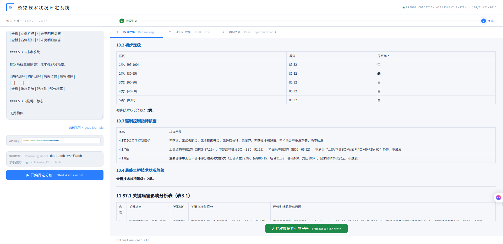

# BIDS-MC

**Bridge Intelligent Diagnosis System, Mechanism-Constrained**
面向桥梁技术状况评定的机理约束 LLM 推理框架——本仓库同时包含论文方法论对应的**核心提示词材料**（`system_prompts/`）和一套**可直接运行的桌面演示应用**（前端页面 + FastAPI 后端）。

> **Note for non-Chinese-speaking readers**: The live interface (`index.html`) uses Chinese as the primary language for its static labels/buttons — matching its target users, Chinese highway bridge inspection engineers working under the JTG/T H21-2011 standard — with an English gloss shown inline next to each core control, plus an English `title` tooltip on hover. Runtime status and error messages are in English. A step-by-step English walkthrough is provided below under **"Quick Start (English)"**. The scientific artifact itself — prompt logic and knowledge base — lives in `system_prompts/`; the content there is primarily in Chinese (including the section headings, e.g. "S0 数据清洗与完整性校验"), consistent with the JTG/T H21-2011 standard being cited. Each step is however tagged with a short cross-reference back to the paper's original English section names (e.g. *"对应论文 Section 2.4.1 Specification Layer"*), so the mapping to the paper can be traced without reading Chinese.

## 两种使用方式

**如果你只是想用这个工具做桥梁检测分析**（不需要懂代码）：去本仓库右侧 **Releases** 页面，下载最新的 `BridgeAssessment.exe`，双击运行即可，全程不需要安装 Python 或做任何配置。

**如果你想核对提示词逻辑、复现论文方法论、或者想自己改代码**：继续看下面的"从源码运行"和"提示词与论文的对应关系"两节。

## 两个环节（推理流程）

BIDS-MC 完整流程分两步,前后端配合完成:

1. **推理**（`/analyze`，`reasoning_effort` 固定为 `high`）：页面输入桥梁病害数据 → 用 `system_prompts/` 下拼接的推理提示词调用 LLM 输出推理报告(含思考过程)
2. **提取**（`/extract`，`reasoning_effort` 固定为 `low`，提取任务不需要高强度推理，兼顾速度与token成本）：用提取提示词 + 推理报告 + 原始数据 → LLM 输出结构化 JSON(`chapter6/7/8` 等),页面渲染"案例复现"全景视图

## 目录结构

```
├── README.md
├── index.html                # 前端页面(推理 / 提取 / 案例复现三面板)
├── main.py                   # FastAPI 后端:/ /analyze /extract /health /heartbeat
├── prompts.py                # 提示词构建模块(启动时读入 system_prompts/ 并拼接,提供推理/提取两套提示词)
├── launcher.py                # 一键启动:起服务并自动打开浏览器
├── requirements.txt
├── .gitignore                # 排除 build/、dist/、__pycache__ 等打包产物（不提交二进制到仓库，见下）
├── system_prompts/           # 论文方法论对应的核心材料
│   ├── README.md
│   ├── reasoning_pipeline_prompt.md    # 推理链逻辑（S0-S7，逐节标注对应论文 Section）
│   ├── knowledge_base_JTG_T_H21.md     # 规范知识库（JTG/T H21-2011 条文与病害图解手册）
│   └── case_jiangdongao_bridge.md      # 脱敏后的案例数据（已去除路线名/桩号/检测单位）
└── example_output/           # 针对 case_jiangdongao_bridge.md 示例输入的实际运行输出（供复现核对）
    ├── example_reasoning_output.md     # 推理阶段完整输出文本（含思考过程）
    ├── example_result.json             # 提取阶段生成的结构化 JSON 结果
    └── screenshots/                    # 应用界面截图
        ├── interface_01.png
        ├── interface_02.png
        ├── interface_03.png
        ├── interface_04.png
        └── interface_05.png
```

## 从源码运行

```bash
# 1. 安装依赖
pip install -r requirements.txt

# 2. 启动(推荐 launcher,自动打开浏览器)
python launcher.py
#    或手动启动
python main.py
#    浏览器访问 http://127.0.0.1:8010
```

启动后在页面"输入数据"栏粘贴桥梁病害数据(或点击"加载示例"载入内置的脱敏案例),填入 DeepSeek API Key,点击"开始评定分析"即可。推理模型固定为 `deepseek-v4-flash`、思考默认开启。API Key 也可通过环境变量 `DEEPSEEK_API_KEY` 提供。

关闭浏览器标签页后,后端会在约 8 秒内自动检测到页面已关闭并退出程序(前端每 3 秒发送一次心跳 `/heartbeat`,后端 watchdog 线程超时未收到心跳即自动退出),无需手动到任务管理器结束进程。若网页仍开着但连续多次心跳失败(通常意味着后端进程已因长时间闲置被 watchdog 判定关闭而自动退出),页面会弹出提示条，告知用户关闭本页面并重新运行程序(此时不提供"重试"选项，因为后端确实已经不在了，重试也无法连接)。

## 重新打包 exe（仅维护者需要）

打包配置文件（`BridgeAssessment.spec`）未包含在本仓库中，由维护者在本地单独保管。exe 发布走 GitHub Releases，不进入本仓库的版本历史（见 `.gitignore`）；最终用户始终从 Releases 页面下载现成的 exe，不涉及本节内容。

## 输入格式

页面文本域接受自然语言的桥梁检测数据,参考结构(与内置"加载示例"一致):

| 内容 | 说明 |
|---|---|
| 桥梁名称 / ID / 报告编号 / 检测日期 | 记录元信息 |
| 桥梁参数 | 结构形式、跨径、宽度、设计荷载等 |
| 上次检测情况 | 用于发展趋势判断,可留空 |
| 桥梁部件划分及构件数量 | 各部件的构件数(按规范 16 类部件) |
| 各构件病害数据 | 位置、病害描述、尺寸(锈胀露筋面积、裂缝长度等) |

## 提示词与论文的对应关系

`system_prompts/` 是 BIDS-MC（Bridge Intelligent Diagnosis System with Mechanism Constraints）四层推理框架的核心可执行实现，对应论文中 **规范层（Specification）→ 机理层（Mechanism）→ 优化层（Optimization）→ 判断层（Judgment）** 的完整逻辑。

| 层级 | 对应文件章节 | 作用 |
|---|---|---|
| 规范层 Specification | S0 – S1 | 数据清洗、构件台账建立、病害归属校验、依规范表格确定初步标度 |
| 机理层 Mechanism | S2.1 – S2.2 | 发展趋势判断、病害机理模式匹配（M1–M8）、结构安全风险定级 |
| 优化层 Optimization | S2.3 – S2.4 | 基于风险等级与发展趋势对标度进行有约束的校准（趋势修正） |
| 判断层 Judgment | S3 – S6 | 构件/部件/结构部位递归评分、全桥定级 |

`S7`（关键病害影响分析与养护决策）对应论文 Section 2.5 Output Stage，不属于 2.4 节四层框架本身，是四层推理完成后的输出阶段。

两个文件在实际调用大模型时**拼接注入同一个 system prompt**（见 `prompts.py`）：`knowledge_base_JTG_T_H21.md` 提供推理所依据的规范原文与病害判据数据，`reasoning_pipeline_prompt.md` 提供强制性的分步推理逻辑与格式约束。`reasoning_pipeline_prompt.md` 每个 S0–S7 章节标题下都标注了对应论文 Section，方便逐条核对。

`example_output/` 下提供了针对 `system_prompts/case_jiangdongao_bridge.md` 这份示例输入的实际运行结果——`example_reasoning_output.md`（完整推理过程文本）与 `example_result.json`（提取阶段生成的结构化 JSON），供核对提示词实际输出效果；`screenshots/` 下是应用界面截图。



## 复现说明

- **适用范围**:当前系统提示词主要针对**梁式桥(空心板)场景**。
- **模型**:固定使用 DeepSeek 系 `deepseek-v4-flash`,推理与提取均在 `main.py` 顶部配置(`DEEPSEEK_MODEL` / `EXTRACT_MODEL`)。
- **输出波动**:LLM 输出存在一定波动,这是模型固有属性。本系统**不提供"标准答案"输出**——不同次运行在机理判定、养护建议等细项上可能存在合理差异,请以提示词框架是否被正确执行为复现重点。
- **评定计算**:标度校准与全桥等级判定遵循 JTG/T H21-2011,由推理环节 LLM 依据提示词中的 S0–S7 逻辑链计算得出,并在提取环节填入结构化 JSON。

## 版本与引用

- 提示词版本对应论文投稿版本，推理链结构与论文 Section 2.4 Analysis Stage 的四层框架一一对应。
- 知识库中摘录的规范条文（JTG/T H21-2011 及配套规程）版权归其发布/编制机构所有，本仓库仅摘录用于学术复现与同行评审目的。

---

## Quick Start (English)

The interface itself stays in Chinese (see note above), but the workflow is simple and every control is labeled below with its Chinese text alongside the English meaning.

1. **Just want to try it?** Download the pre-built `BridgeAssessment.exe` from the **Releases** page — no installation needed.

2. **Running from source:**
   ```bash
   pip install -r requirements.txt
   python launcher.py        # or: python main.py
   # opens http://127.0.0.1:8010 in your browser
   ```

3. **Left panel — "输入数据" (Input Data)**

   | Chinese label | Meaning |
   |---|---|
   | 输入数据 | Input Data — the text box below accepts free-text bridge inspection data (bridge info, member inventory, defect records per member) |
   | 加载示例 · Load Example | Loads a built-in, desensitized sample case |
   | API Key | Paste your DeepSeek API key here, or set it via the `DEEPSEEK_API_KEY` environment variable |
   | 推理模型 | Reasoning model — fixed to `deepseek-v4-flash` |
   | 思考强度：high | Extended thinking is enabled, reasoning effort fixed at `high` for the reasoning stage (extraction stage uses `low`) |
   | ▶ 开始评定分析 | **Start Assessment** — click to begin the reasoning pipeline |
   | ■ 停止 | **Stop** — cancel a running analysis |

4. **Right panel — output tabs**

   | Chinese label | Meaning |
   |---|---|
   | 1 · 推理过程 | Reasoning — the model's live streamed reasoning/output |
   | 2 · JSON 数据 | JSON Data — structured data extracted from the reasoning report (click "✔ 提取数据并生成报告" / **Extract Data & Generate Report** first) |
   | 3 · 案例复现 | Case Reproduction — a fully rendered walkthrough of the S0–S7 pipeline for this bridge, once extraction is done |
   | ⬇ 下载 JSON | **Download JSON** — save the extracted structured result to a file |

5. **Closing the app**: closing the browser tab automatically shuts down the background server within ~8 seconds (heartbeat-based watchdog); no need to end the process manually in Task Manager. If the page stays open but the backend has already exited (e.g. after a long idle period), a banner will appear telling you to close the page and re-run the program.

6. **What stays in Chinese regardless of interface language**: the actual inspection content — defect descriptions, component names, trend judgments — is generated by the model from a Chinese knowledge base (JTG/T H21-2011 and its supporting standards) and will always be in Chinese, independent of the UI language. See `system_prompts/` for how this maps to the paper's four-layer (Specification / Mechanism / Optimization / Judgment) framework.
